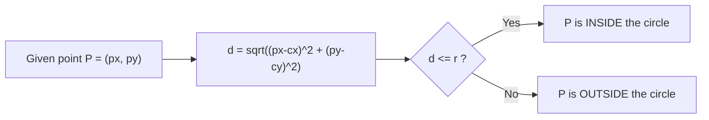

# CSC360: Computer Graphics and Image Processing
## Reflection Journal — Session 8

---

### Session Metadata
- **Course Code:** CSC360
- **Course Name:** Computer Graphics and Image Processing
- **Student ID:** AU2420150
- **Session Number:** Session 08
- **Session Date:** September 01, 2026
- **Entry Date:** September 03, 2026

---

## 1. Overview

Session 8 opened with group project assignments and then pivoted into a linear algebra refresher, tying systems of equations directly to the geometry needed for one of the group projects. The session closed with the distance formula, a point-in-circle check, and a look at Stack vs. Queue in the context of an undo/erase feature.

Key topics covered in this session include:
- **Group Project Rollout:** Four projects announced — triangle drawing from equations, canvas circle/arrow linking, binary tree visualization, and ASCII tree printing.
- **Linear Equations as Geometry:** Reframing $ax + by = c$ as a line, and systems of equations as intersecting lines.
- **Determinants & Vectors:** Row/column vector notation and using the determinant to test for a unique solution.
- **Distance Formula from Pythagorean Theorem:** Deriving straight-line distance between two canvas points.
- **Point-in-Circle Test:** Using the distance formula to determine spatial containment.
- **Stack vs. Queue for Undo:** Why LIFO structures match user expectations for erasing drawn objects.
- **Maven for Numerical Computing:** Using dependency declarations to pull in math libraries without manual JAR management.

---

## 2. Group Project Rollout

Four projects were introduced this session, each grounded in a different graphics or data-structure concept:

| Group | Project | Core Concept |
| :--- | :--- | :--- |
| **1** | Draw a triangle from three linear equations (text input) | Systems of linear equations $\to$ geometry |
| **2** | Draw circles via right-click, connect with arrows | Canvas events, point-to-point linking |
| **3** | Binary tree visualization | Tree data structures |
| **4** | Print an ASCII tree | Text-based tree rendering |

> [!TIP]
> **Collaboration Setup:**  
> Each group creates a shared repository and adds all members as collaborators from day one, so contribution history and changes are tracked from the start rather than retrofitted later.

---

## 3. Linear Equations as Geometry

Group 1's project motivated a full linear algebra refresher, since a linear equation of the form $ax + by = c$ is really a line in 2D space:
- **One equation:** One line.
- **Two equations:** Two lines, whose solution is their intersection point.
- **Three equations:** Three lines, which together can form a triangle.

### Worked Example:
$$\begin{aligned} 2x + 3y &= 5 \\ 3x + 2y &= 6 \end{aligned}$$

Written in matrix-vector form, the coefficients form a matrix and the variables form a column vector:
$$\begin{bmatrix} 2 & 3 \\ 3 & 2 \end{bmatrix} \begin{bmatrix} x \\ y \end{bmatrix} = \begin{bmatrix} 5 \\ 6 \end{bmatrix}$$

### Determinant Test for a Unique Solution:
$$\begin{vmatrix} 2 & 3 \\ 3 & 2 \end{vmatrix} = (2 \times 2) - (3 \times 3) = 4 - 9 = -5$$

> [!NOTE]
> **Non-Zero Determinant:**  
> A non-zero determinant confirms the two lines intersect at exactly one point — this is the condition Group 1's triangle-drawing logic depends on when validating three input equations.

---

## 4. Distance Formula — Derivation from the Pythagorean Theorem

Given two points $(x_1, y_1)$ and $(x_2, y_2)$:

$$d = \sqrt{(x_2 - x_1)^2 + (y_2 - y_1)^2}$$

```
(x2, y2)
    *
    |
    |  (y2 - y1)   <- vertical leg
    |
    *------------
(x1, y1)  (x2 - x1)  <- horizontal leg
```

The horizontal and vertical gaps between the points form the two legs of a right triangle; the straight-line distance is the hypotenuse. Applying $a^2 + b^2 = c^2$ and taking the square root of both sides gives the distance formula directly.

### Application: Point-in-Circle Check

Given a circle with center $(c_x, c_y)$ and radius $r$, and a test point $P = (p_x, p_y)$:



> [!IMPORTANT]
> **Containment Is Just a Comparison:**  
> Checking whether a point lies inside a circle reduces to computing one distance and comparing it against a known radius — no separate geometric machinery is needed once the distance formula is in place.

---

## 5. Stack vs. Queue for Undo/Erase

- **Stack (LIFO - Last In, First Out):** The last object drawn is the first one erased.
- **Queue (FIFO - First In, First Out):** The oldest object drawn would be erased first.

In a drawing application, users expect "undo" to remove their most recent action — which is exactly what a **Stack** provides and a Queue does not.

---

## 6. Maven for Numerical Computing

Maven's dependency management extends naturally to heavyweight math libraries (e.g., Apache Commons Math, EJML, ND4J): declaring them in `pom.xml` lets Maven fetch the correct version from the Central Repository and keep it consistent across every developer's machine.

> [!NOTE]
> **Why This Matters:**  
> Without Maven, adding a numerical library means manually downloading JARs and resolving version conflicts by hand — a process that becomes unmanageable once a project depends on several math libraries simultaneously.

---

# Key Takeaways

1. **Equations Are Lines:** Three linear equations of the form $ax + by = c$ can define the three sides of a triangle — the mathematical basis of Group 1's project.
2. **Determinant as a Solvability Test:** A non-zero determinant of the coefficient matrix confirms a system of two equations has a unique intersection point.
3. **Distance Formula Derivation:** $d = \sqrt{(x_2 - x_1)^2 + (y_2 - y_1)^2}$ follows directly from the Pythagorean theorem applied to axis-aligned legs between two points.
4. **Point-in-Circle Reduces to a Comparison:** Compute the distance from the point to the center; if it's $\le r$, the point is inside.
5. **Stack Matches Undo Expectations:** LIFO ordering erases the most recently drawn object first, matching how users intuitively expect undo to behave.
6. **Maven Simplifies Numerical Dependencies:** Declaring math libraries in `pom.xml` removes the need for manual JAR management and version conflict resolution.

---

## Final Reflection

Session 8 was the clearest demonstration yet of how abstract math becomes concrete once tied to a visual task. Recalling systems of linear equations from second semester felt slow in isolation, but the moment each equation was reframed as a line on a canvas — and three lines as a triangle — the recall accelerated immediately. The same pattern held for the point-in-circle check: what looked like a new geometric concept turned out to be a single distance comparison built entirely on the Pythagorean theorem. The session reinforced that visual framing, not repetition of formulas, is what makes half-remembered math usable again.
