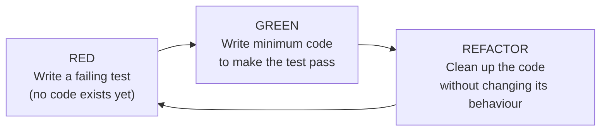

# CSC360: Computer Graphics and Image Processing
## Reflection Journal — Session 9

---

### Session Metadata
- **Course Code:** CSC360
- **Course Name:** Computer Graphics and Image Processing
- **Student ID:** AU2420150
- **Session Number:** Session 09
- **Session Date:** September 03, 2026
- **Entry Date:** September 10, 2026

---

## 1. Overview

Session 9 continued the group project walkthrough (Groups 4-8), then moved into two infrastructure-adjacent topics: headless systems and remote access, and Test-Driven Development as a discipline rather than an afterthought.

Key topics covered in this session include:
- **Group Projects 4-8:** ASCII tree printing, list-linking arrows, animated splash screens, a persistent object tree, and cooperative thread management.
- **Print vs. Draw:** Why outputting text characters and rendering pixels are fundamentally different operations.
- **Headless Systems:** Why most real-world servers have no display, and why SSH — not remote-desktop tools - is the correct access method.
- **Test-Driven Development (TDD):** The Red-Green-Refactor cycle and testing as specification rather than verification.
- **Graceful Thread Cancellation:** Signalling a thread to stop safely instead of force-terminating it.

---

## 2. Group Projects 4–8

| Group | Project | Core Concept |
| :--- | :--- | :--- |
| **4** | Print an ASCII tree | Text output vs. graphical rendering |
| **5** | Draw arrows linking common elements between two lists | Cross-referencing, canvas drawing |
| **6** | Splash screen (logo, animation, sound, version) | App initialization UX |
| **7 (my group)** | Editable object tree, persisted to disk | Tree structures + persistent storage |
| **8** | Thread management with graceful cancellation | Concurrency, cooperative state control |

> [!IMPORTANT]
> **Print vs. Draw Is Not Interchangeable:**  
> "Printing" an ASCII tree means arranging text characters in a terminal to visually suggest a shape - it is a console/text-stream operation. "Drawing" renders actual pixels on a canvas surface (e.g., JavaFX). Conflating the two means building the wrong tool for the assignment. Sketching the tree hierarchy on paper before coding was recommended as a concrete first step to avoid this confusion.

---

## 3. Headless Systems & Remote Access

A headless system is a computer running without a monitor, keyboard, or mouse - no local display and no physical interface. This is not an edge case: the vast majority of servers worldwide (cloud instances, CI/CD build machines, Raspberry Pi units in racks) run headlessly by design.

```
+---------------------------+          SSH (no display layer)          +---------------------------+
|      Local Machine        |  ---------------------------------------> |     Headless Server        |
|  (has monitor/keyboard)   |     command-line shell, no GUI needed     |  (no monitor/keyboard)     |
+---------------------------+                                          +---------------------------+
```

> [!TIP]
> **SSH vs. Remote Desktop Tools:**  
> Tools like AnyDesk or TeamViewer stream a full GUI desktop from the remote machine, which requires that machine to render a graphical environment - costing resources it may not have. SSH gives a direct command-line shell with no display layer at all, making it the correct (and often only viable) tool for a truly headless machine. The SSH key setup from Sessions 2-3 (originally used for GitHub authentication) is the same mechanism used to authenticate with any remote server.

---

## 4. Test-Driven Development (TDD)

TDD inverts the conventional order of writing code first and tests second. Instead, the test is written before any implementation exists, following the Red-Green-Refactor cycle:



- **Red:** Write a test that fails because the implementation doesn't exist yet.
- **Green:** Write the minimum code required to make the test pass.
- **Refactor:** Clean up the implementation without changing its observable behavior.

The cycle repeats in short increments.

> [!NOTE]
> **Test as Specification, Not Verification:**  
> The counterintuitive part of Red is writing a test against code that doesn't exist and expecting it to fail - that's the correct outcome, not a mistake. Framing the test as a specification (defining what the code must do before deciding how) resolves the discomfort: you're describing desired behavior first, then implementing to match it.

This builds directly on Session 7's introduction of unit and integration testing - TDD turns that testing mindset into the starting point of development rather than a safety net added afterward.

---

## 5. Graceful Thread Cancellation (Group 8)

Group 8's project requires running multiple concurrent processes, tracking their states, and supporting graceful cancellation - signalling a thread to stop at a safe checkpoint rather than force-terminating it.

> [!IMPORTANT]
> **Why Not Force-Stop:**  
> Abruptly terminating a thread mid-execution can leave shared resources in an inconsistent state, risking data corruption or deadlocks. Cooperative, checkpoint-based cancellation avoids this by letting the thread finish its current safe operation before stopping.

---

## Key Takeaways

1. **Print $\neq$ Draw:** Text-character output (ASCII art) and pixel rendering (canvas graphics) require completely different tools - conflating them leads to building the wrong solution.
2. **Headless Is the Default, Not the Exception:** Most servers (cloud, CI/CD, embedded) have no display; SSH is the primary and correct access method, not a workaround.
3. **SSH Reuses Familiar Infrastructure:** The same SSH key setup used for GitHub authentication (Sessions 2–3) authenticates with any remote machine, headless or not.
4. **TDD Cycle — Red, Green, Refactor:** Write a failing test first, write minimal code to pass it, then refactor without changing behavior. The test is a specification of desired behavior, not a post-hoc check.
5. **Graceful Cancellation Prevents Corruption:** Signalling a thread to stop at a safe checkpoint avoids the inconsistent shared-resource states that force-termination can cause.
6. **Paper Sketches Aid Structural Reasoning:** Drawing a tree hierarchy on paper before coding makes the structure easier to reason about than starting directly from a blank editor.

---

## Final Reflection

Session 9 tied together two threads that initially seemed unrelated: infrastructure access and development methodology. Both came down to the same underlying lesson - the "obvious" tool isn't always the right one. Remote desktop software feels like the natural way to access another machine, but it fails precisely where it matters most (headless servers). Writing code first and testing after feels like the natural order of development, but TDD's Red-Green-Refactor cycle showed that inverting this order produces clearer specifications and fewer surprises later. The description of Group 7's project - reframing something I use daily (a file explorer's tree panel) as a system I could actually build - was the moment this clicked hardest: familiarity with an interface doesn't mean understanding the system behind it, and this session closed that gap.
